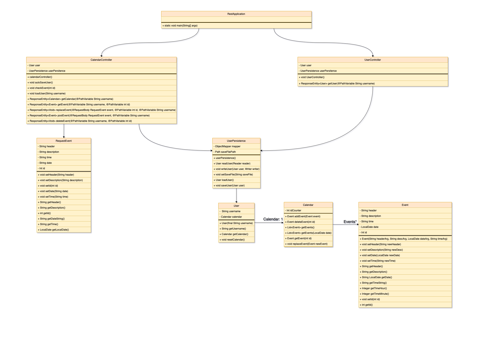

# Calendar

## Oversikt

Dette prosjektet er et REST-api bygget på java, maven og spring-boot. REST-apiet tilbyr tjenester for klienten til prosjektet.

## Dokumentasjon

### Moduler

#### core

Modul for kjerneklassene til REST-apiet. Inneholder også klasser for å håndtere JSON.

#### rest

Modul for REST-apiet. Bygget ved hjelp av spring-boot og spring-boot-web.

#### fxui

Ble tidligere brukt som klient, men byttet ut med egen react-klient.

### Rest-dokumentasjon

Dokumentasjonen for REST-apiet finner du [her](../docs/resources/rest-service-doc.md)

### Klassediagram

