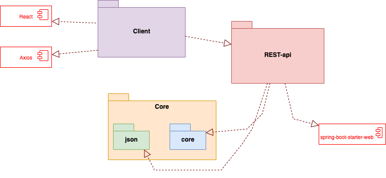
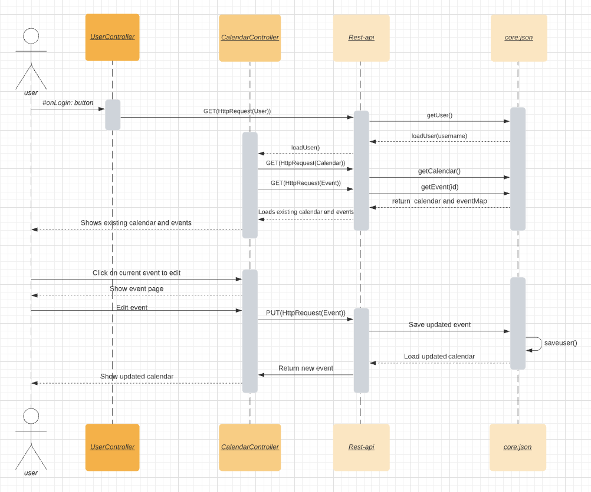

[](https://gitpod.stud.ntnu.no/#https://gitlab.stud.idi.ntnu.no/it1901/groups-2021/gr2156/gr2156/-/tree/master)

# Kalender app

Prosjektet vårt er en kalender-app med flere brukere. En bruker kan "logge seg inn" og få åpnet en kalender med alle hendelsene hen har lagt inn. Brukeren kan også legge inn nye hendelser, og oppdatere ekisterende hendelser.

## Oversikt

-   [Bygging og kjøring av prosjektet](#bygging-og-kjøring-av-prosjektet)
-   [Filstruktur](#filstruktur)
-   [Dokumentasjon](#dokumentasjon)
-   [Brukerhistorier](#brukerhistorier)

## Bygging og kjøring av prosjektet
Prosjektet kan kjøres gjennom fxui eller som web-applikasjon.

For å kjøre applikasjonen:

```bash
cd calendar
mvn install
cd fxui
mvn javafx:run
```
---

For å kjøre api-serveren:

```bash
cd calendar
mvn install
cd rest
mvn spring-boot:run
```

For å kjøre web-klienten:

```bash
cd calendar-client
npm install
npm start
```

## Filstruktur

I rot-mappen finner man:

-   calendar-client: Klient skrevet i typescript med react
-   calendar: Rest-api skrevet i java med maven og spring-boot

## Dokumentasjon

Mer dokumentasjon for hver tjeneste finner man i deres respektive mapper.

-   [calendar-client](./calendar-client/README.md)
-   [calendar](./calendar/README.md)

### Pakkediagram



### Sekvensdiagram



## Brukerhistorier

Brukerhistor finner du [her](./docs/resources/brukerhistorier.md)
